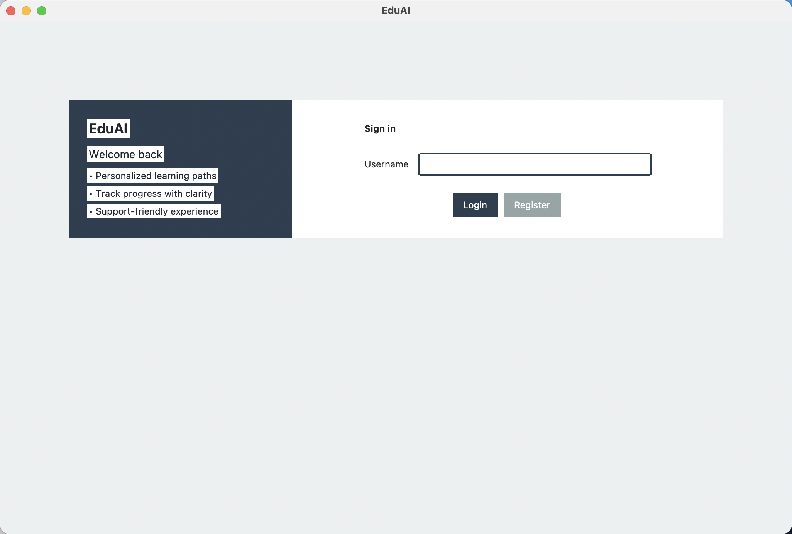
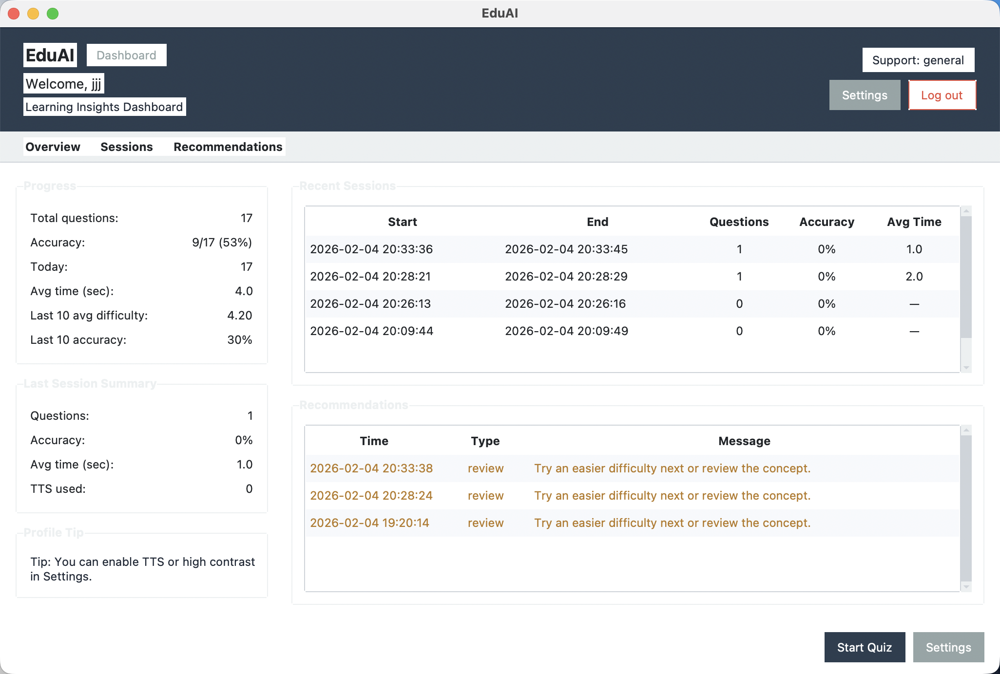
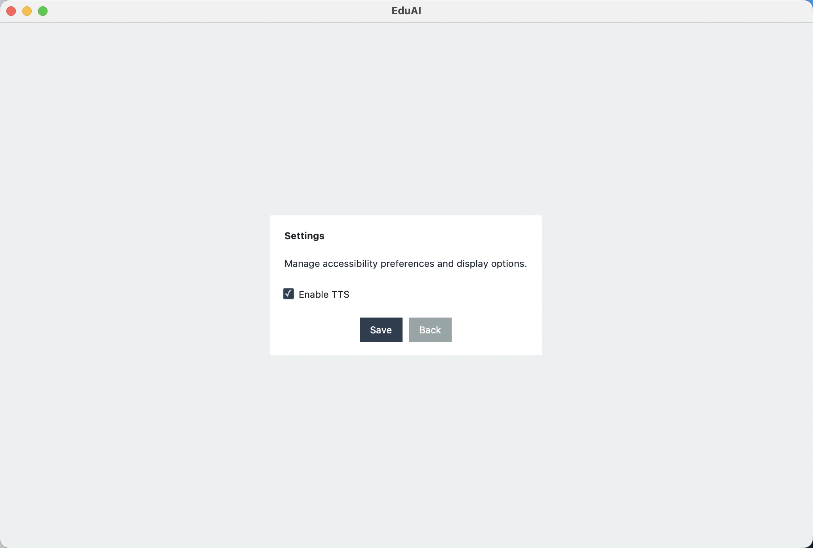
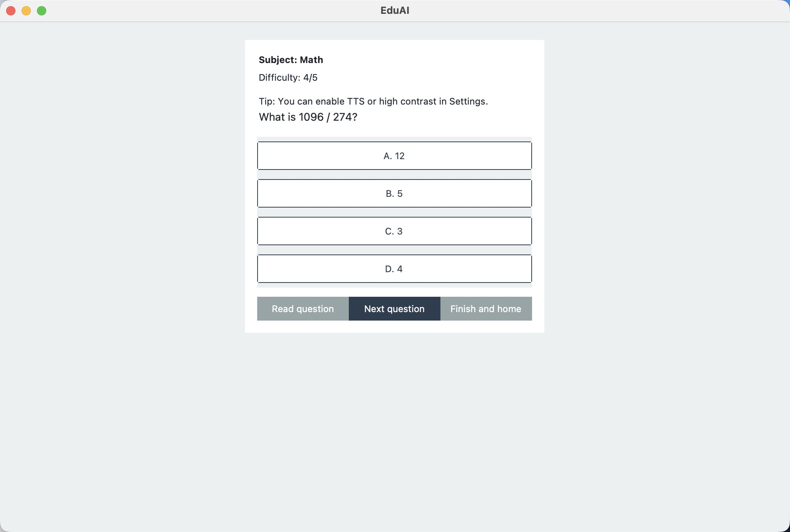

**CHAPTER 3: RESULTS (IMPLEMENTATION & OUTPUT EVIDENCE)**

This chapter provides direct evidence that EduAI is a working system. It focuses on implementation, execution, data output, and measurable results rather than design ideas. The emphasis is on what the system actually does when run locally.

**3.1 System Implementation Overview**

EduAI runs as a local desktop application. The system starts by initializing a local SQLite database, then launches a multi-page GUI that users can navigate through login, registration, learning, and settings flows. The system is fully executable on a laptop without cloud services, and all learning data (questions, attempts, sessions, and recommendations) is stored locally for privacy.

Core modules implemented in the working system include:

UI layer for user interaction (login, dashboard, quiz, settings),
Quiz engine to deliver questions and record attempts,
Adaptive difficulty logic to adjust question difficulty based on performance,
Recommendation logic to generate rule-based learning suggestions,
Text-to-Speech support for accessibility,
SQLite database for persistent learning data.

This confirms EduAI is not just a design concept but a running application that produces real outputs and data.

**3.2 User Interface Implementation**

The UI was implemented to support SEN learners with clarity, accessible controls, and simple navigation. Each major screen is functional and produces outputs.

**Login / Register**
Users can log in or register a new profile. SEN profile selection is stored and later used to personalize defaults.  
**Screenshot placeholder:**  

**Dashboard**
The dashboard displays learning progress, session summaries, and recommendations. It visualizes learning data in a readable format (totals, accuracy, recent sessions).  
**Screenshot placeholder:**  

**Settings**
Settings allow accessibility preferences such as TTS and high-contrast mode. These are stored in the database and applied on subsequent logins.  
**Screenshot placeholder:**  

**Quiz (Practice)**
The quiz screen delivers questions, tracks answers, and updates difficulty in real time. This is the main interaction point for learners.  
**Screenshot placeholder:**  

These UI screens demonstrate that learning, personalization, and analytics are accessible through a working interface.

**3.3 Adaptive Difficulty & Personalization Results**

EduAI uses a rule-based adaptive mechanism (adaptive AI, not deep learning). Difficulty is adjusted after each answer:

If the user answers correctly → difficulty increases by 1  
If the user answers incorrectly → difficulty decreases by 1  
Difficulty is clamped within levels 1–5  

Example adaptive flow (observed in execution):

Question at difficulty 3 → correct → next difficulty becomes 4  
Another correct → difficulty becomes 5  
Incorrect at 5 → difficulty drops to 4  

SEN profile personalization is also active:

**Dyslexia**: TTS enabled by default, high-contrast enabled  
**ADHD**: standard layout, but focus reminder tips displayed  
**Autism**: structured feedback in quiz results  

This shows that the system adapts not only to performance data but also to user support needs. The behavior is data-driven and explainable.

**3.4 Learning Analytics & Session Results**

EduAI records all attempts and session metrics in the database. The dashboard summarizes them into interpretable indicators:

Session-level metrics include:
Total questions attempted  
Accuracy rate  
Average time per question  
Number of TTS uses  

Example metrics observed in the dashboard:

**Table 3.1: Example Learning Analytics Output**

|**Metric**|**Example Value**|
| :- | :- |
|Total Attempts|15|
|Accuracy|60%|
|Avg Time per Question|4.3 sec|
|Difficulty Trend|1 → 4|
|TTS Usage (Last Session)|2|

This demonstrates that the system is not just giving quizzes, but actively capturing learning evidence for analysis.

**3.5 Recommendation System Output**

EduAI generates rule-based recommendations after each question attempt. Recommendations are stored and displayed in the dashboard, making the system explainable and actionable.

Example recommendation outputs:

review → “Try an easier difficulty next or review the concept.”  
general → “Keep going! Try another question.”  
support → “Consider enabling TTS or taking a short break.”  

The rules are linked to observable data:

Wrong answer → review recommendation  
Streak of correct answers → challenge recommendation  
Long time per question → support recommendation  

These outputs provide interpretable feedback and demonstrate implemented personalization.

**3.6 Summary of Results**

EduAI successfully demonstrates a working system with measurable outputs. The implementation proves:

Personalized learning based on SEN profiles  
Adaptive difficulty that changes in real time  
Learning analytics captured and visualized  
Actionable recommendations generated automatically  

Overall, Chapter 3 confirms that EduAI is a functioning system with real execution, real data, and real output evidence.
