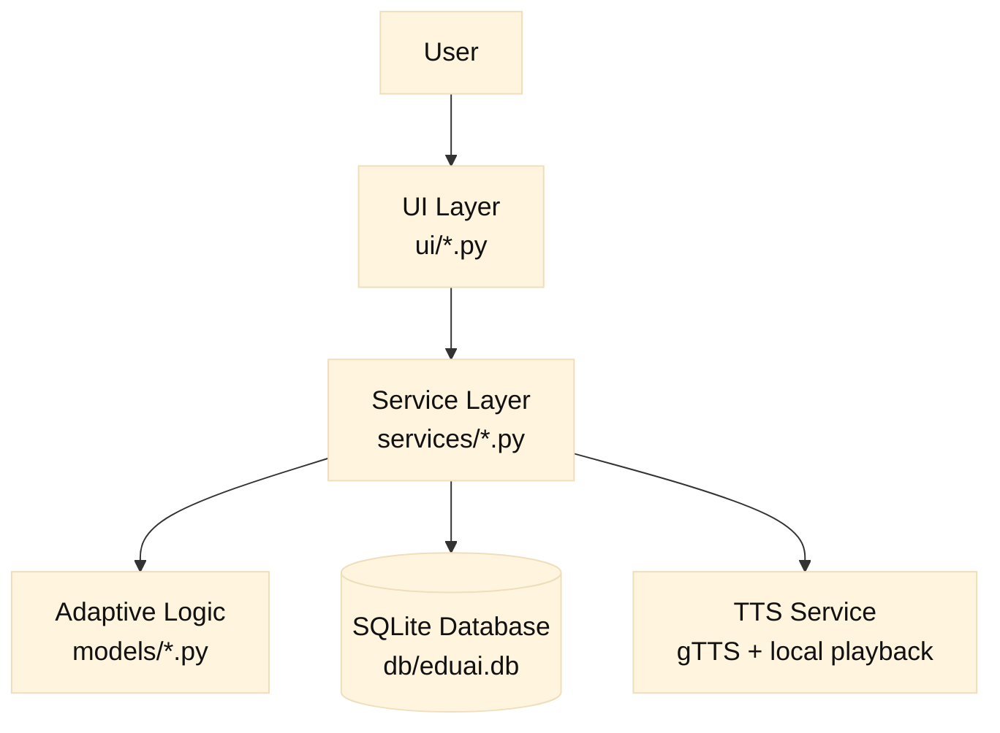
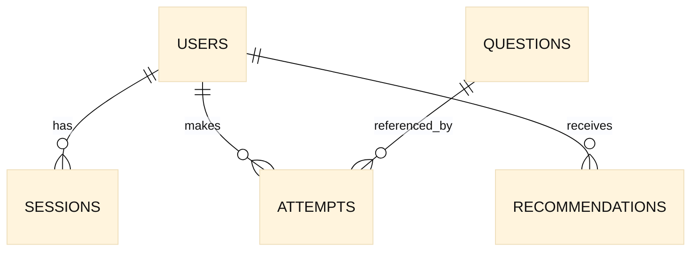
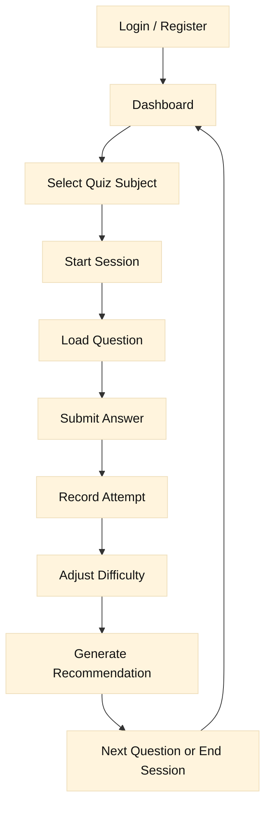

# EduAI Code Documentation

  
## 1. Project Overview

EduAI is a desktop learning assistant designed for students with Special Educational Needs (SEN).

The current release supports two subjects:

- Math

- English

Main features:

- User registration and login

- Adaptive quiz difficulty

- Session and attempt tracking

- Rule-based learning recommendations

- Text-to-Speech (TTS) support

- Dashboard subject filter (`All`, `Math`, `English`)


---
## 2. Technology Stack

- Language: Python 3.10+

- UI: `ttkbootstrap` (Tkinter-based)

- Database: SQLite (local file)

- TTS: `gTTS`

Application entry point:

- `main.py` 

---
## 3. High-Level Architecture
  



  
Layer responsibilities:

- UI layer handles screens, user events, and rendering.

- Service layer handles business logic and SQL operations.

- Model layer contains adaptive difficulty logic.

- Database stores users, questions, sessions, attempts, and recommendations.

---
## 4. Repository Structure and Module Responsibilities

## 4.1 Root files

- `main.py`: starts the app and ensures the database is ready.

- `requirements.txt`: Python dependencies.

- `README.md`: setup and run instructions.

- `CODE_DOCUMENTATION.md`: this document.

## 4.2 Database layer (`db/`)

- `db/database.py`

- `get_conn()`: opens SQLite connection with foreign keys enabled.

- `init_db()`: creates tables from `schema.sql`.

- `seed_db()`: loads base seed data from `seed.sql`.

- `ensure_db_ready()`: initializes schema, runs lightweight migrations, and auto-loads English seed if missing.

- `db/schema.sql`: schema definition.

- `db/seed.sql`: initial users and Math questions.

- `db/seed_english.sql`: English question bank.

## 4.3 Service layer (`services/`)

- `user_service.py`: user CRUD operations, profile defaults, and profile tips.

- `quiz_service.py`: question retrieval, fallback difficulty selection, session lifecycle, and attempt recording.

- `progress_service.py`: dashboard statistics and session summaries (supports subject-based filtering).

- `recommendation_service.py`: inserts and fetches recommendation records (subject-aware).

- `tts_service.py`: audio generation/cache and playback fallback.

## 4.4 Model layer (`models/`)

- `difficulty.py`: defines difficulty enum (`1..5`) and clamping.

- `recommender.py`: computes next difficulty (`+1` correct, `-1` incorrect).

## 4.5 UI layer (`ui/`)

- `app.py`: root window and frame router.

- `login_view.py`: login screen.

- `register_view.py`: account creation screen.

- `dashboard_view.py`: overview/session/recommendation dashboard with subject filtering.

- `quiz_view.py`: quiz interaction, adaptive flow, recommendation trigger.

- `settings_view.py`: user settings (e.g., TTS/high-contrast state handling).

- `theme.py`, `widgets.py`: styling tokens and reusable widgets.

---
## 5. Database Design

Core tables:

1. `users`: profile and accessibility preferences.

2. `questions`: subject, topic, difficulty, options, answer, explanation.

3. `sessions`: quiz sessions (`subject` included).

4. `attempts`: per-question user actions and outcomes.

5. `recommendations`: generated guidance (`subject` included).


Entity relationship:

  



  

Notes:

- `attempts.session_id` links attempts to a session.

- `questions.subject` and `sessions.subject` are used for subject-isolated analytics.

---

## 6. Runtime and Business Flow

## 6.1 Startup flow

1. Run `main.py`.

2. `ensure_db_ready()` checks schema/tables.

3. Missing migration columns are added if needed.

4. UI main loop starts.

## 6.2 User flow

1. User registers or logs in.

2. User chooses quiz subject (`Math` or `English`) from Dashboard.

3. Quiz session starts for selected subject.

4. User answers questions.

5. System records attempts, updates adaptive difficulty, and stores recommendations.

6. Dashboard shows filtered metrics by selected subject.

Flow diagram:

  



  

---

## 7. Adaptive Logic and Recommendation Rules

## 7.1 Difficulty adaptation

Current logic is deterministic:

- Correct answer: increase level by 1

- Incorrect answer: decrease level by 1

- Clamp range: `1..5`

  
If no question exists at the current level, the system searches nearby levels (fallback strategy).

## 7.2 Recommendation generation

Recommendations are generated after each answer based on:

- correctness

- correct streak

- average response time

- SEN profile

- TTS usage setting

Typical recommendation types:

- `review`

- `challenge`

- `support`

- `accessibility`

- `general`

---
## 8. Subject Support (Math / English)

Current implementation supports subject isolation in three places:

1. Session scope: each session has a `subject`.

2. Stats scope: dashboard queries can filter by subject.

3. Recommendation scope: recommendation rows include subject.

Dashboard behavior:

- Filter = `All`: combined metrics.

- Filter = `Math` or `English`: subject-specific metrics only.

---

## 9. AI Positioning and ML Clarification

EduAI is an AI-assisted adaptive learning system with rule-based personalization.

Current intelligent functions in this version:

1. Adaptive difficulty adjustment based on user performance.

2. Rule-based personalized recommendations from learner behavior.

3. Accessibility support through TTS integration.

Machine Learning status:

- Core adaptation/recommendation logic is currently rule-based.

- No in-project model training/inference pipeline is implemented yet.

- External AI capability is used for TTS (`gTTS`), not for custom predictive modeling.

---

## 10. Setup and Run

Install:


```bash

  

pip install -r requirements.txt

  

```

  
Run:


```bash

  

python3 main.py

  

```

  
---

## 11. Known Limitations and Future Improvements

1. Recommendation engine is rule-based; could evolve to ML or knowledge tracing.

2. Daily statistics use SQLite date semantics; timezone-local refinement may be needed.

3. English bank is seeded locally; long-term content management can be externalized.

4. Automated tests should be expanded for stronger regression safety.

---

## 12. Version Scope

This documentation matches the current codebase scope:

- Math + English quiz support

- Subject-specific sessions/statistics/recommendations

- Dashboard subject filter

- Rule-based adaptation and recommendation logic